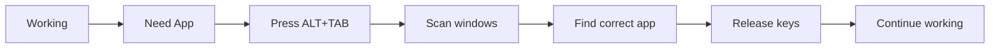
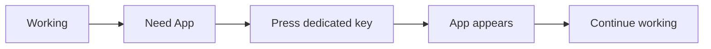

# togler

**Togler**: One key to show, one key to hide. No more ALT+TAB fatigue.

**Togler** (yes, not a typo) is a minimalist command-line tool that banishes ALT+TAB overload by letting you toggle apps with a single keypress. Never lose windows in tab-switching chaos again!

Perfect for keyboard-centric workflows, it creates instant shortcuts to launch, focus, or hide your essential apps. Assign Super+F for Firefox, Super+T for Terminal, and never dig through windows again.

---

## 🚫✋ ALT+TAB Fatigue Solution

Togler solves these common frustrations:

- **Lost windows** in deep ALT+TAB stacks
- **Constant window hunting** for frequently used apps
- **Distracting context switches** when managing windows
- **Mouse dependency** for window management

Instead: **One dedicated key per app**. Press → show. Press again → hide.

---

## ✨ Features

- **Single-key toggling** (press to show, press again to hide)
- **App resurrection** - Launches apps if not running
- **Smart minimization** - Hides focused apps instantly
- **Window cycling** - Rotates through multiple instances
- **Zero configuration** - Works immediately after install
- **GNOME integration** - Simple shortcut creation
- **Lightweight** - Pure Bash with minimal dependencies
- **Interactive prompts** for missing arguments
- **List all bindings** in one command
- **Delete bindings** with confirmation
- **Smarter fallback** logic if keybinding isn't found

---

## 🚀 Usage

```sh
togler -t firefox          # Toggle Firefox visibility
togler -b "<Super>f" code  # Bind Super+F to VS Code
togler -a slack            # Create shortcut for Slack (interactive)
togler -l                  # List all Togler-managed shortcuts
togler -d code             # Delete keybinding for VS Code
```

> 💡 **Pro Tip:** Togler is interactive — if you skip arguments, it will prompt you!

---

## 🧠 Why Togler?

Traditional window switching:



With Togler:



---

## 📦 Installation

```sh
# Install .deb package
sudo dpkg -i togler*.deb

# OR manual install
cp togler ~/.local/bin/ && chmod +x ~/.local/bin/togler
```

> ⚠️ Requires X11 (not Wayland) and `xdotool` (`sudo apt install xdotool`)

---

## 🖥️ Real-World Setup

1. **Create Firefox shortcut**:

   ```sh
   togler -a firefox "Toggle Firefox" "<Super>1"
   ```

2. **Create Terminal shortcut**:

   ```sh
   togler -a terminal "Toggle Terminal" "<Super>2"
   ```

3. **Enjoy workflow**:
   - Press `Super+1` anytime → Firefox appears
   - Press `Super+1` when focused → Firefox hides
   - Press `Super+2` → Terminal toggles
   - No window hunting, no distractions

---

## 🛠️ Technical Notes

- **State tracking**: Uses `/tmp/togler/<app>_state`
- **Multiple windows**: Cycles through instances
- **Activation logic**:

  ```mermaid
  graph TB
    A[App running?] -->|No| B[Launch app]
    A -->|Yes| C[Focused?]
    C -->|Yes| D[Minimize]
    C -->|No| E[Activate]
  ```

- **Keybinding storage**: GNOME `gsettings` system

---

## 📚 Example Workflows

**Web Developer**:

- `Super+1` Firefox
- `Super+2` VS Code
- `Super+3` Terminal

**Writer**:

- `Super+1` LibreOffice
- `Super+2` Research Browser
- `Super+3` Notes

**Sysadmin**:

- `Super+1` Terminal
- `Super+2` Monitoring
- `Super+3` Documentation

---

Made with ❤️ by [Caesar](https://github.com/caesar003) · 🪪 MIT License
