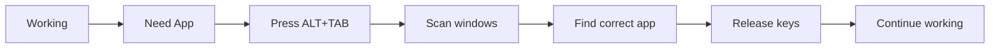
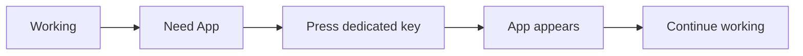
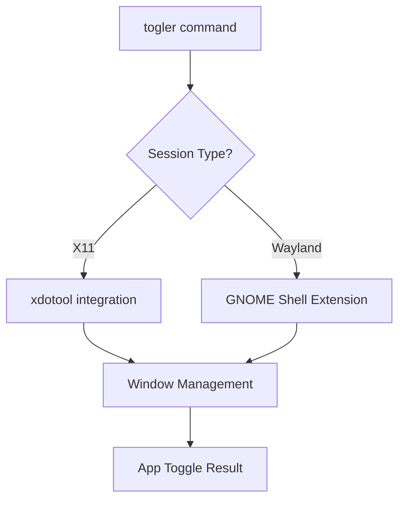
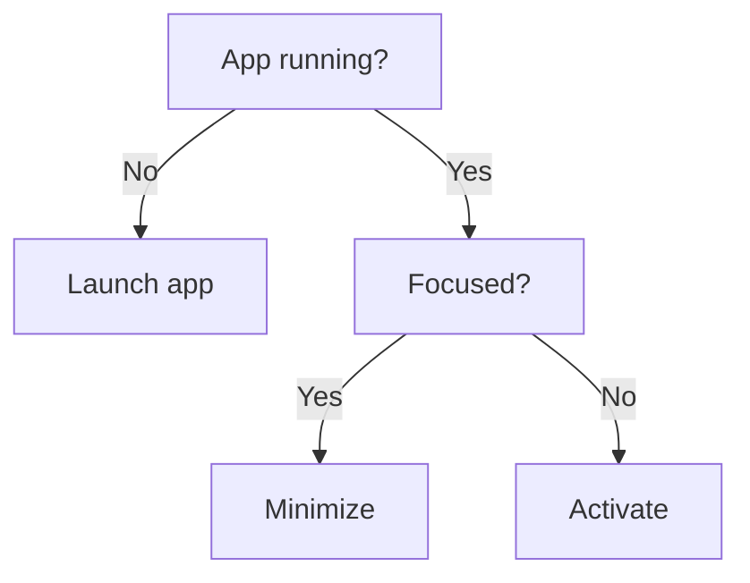

# togler

**Togler**: One key to show, one key to hide. No more ALT+TAB fatigue.

**Togler** (yes, not a typo) is a minimalist command-line tool that banishes ALT+TAB overload by letting you toggle apps with a single keypress. Never lose windows in tab-switching chaos again!

Perfect for keyboard-centric workflows, it creates instant shortcuts to launch, focus, or hide your essential apps. Assign Super+F for Firefox, Super+T for Terminal, and never dig through windows again.

**Now with full Wayland support!** 🎉

---

## 🚫✋ ALT+TAB Fatigue Solution

Togler solves these common frustrations:

-   **Lost windows** in deep ALT+TAB stacks
-   **Constant window hunting** for frequently used apps
-   **Distracting context switches** when managing windows
-   **Mouse dependency** for window management

Instead: **One dedicated key per app**. Press → show. Press again → hide.

---

## ✨ Features

-   **Single-key toggling** (press to show, press again to hide)
-   **App resurrection** - Launches apps if not running
-   **Smart minimization** - Hides focused apps instantly
-   **Window cycling** - Rotates through multiple instances
-   **Zero configuration** - Works immediately after install
-   **GNOME integration** - Simple shortcut creation
-   **Full Wayland support** - Automatic extension setup
-   **X11 compatible** - Traditional xdotool integration
-   **Lightweight** - Pure Bash with minimal dependencies
-   **Interactive prompts** for missing arguments
-   **List all bindings** in one command
-   **Delete bindings** with confirmation
-   **Cross-session compatibility** - Works on both X11 and Wayland

---

## 🖥️ Platform Support

| Session Type | Technology            | Status             | Setup Required                 |
| ------------ | --------------------- | ------------------ | ------------------------------ |
| **X11**      | xdotool               | ✅ Fully supported | `sudo apt install xdotool`     |
| **Wayland**  | GNOME Shell Extension | ✅ Fully supported | 🔧 Auto-installed on first use |

> 🎯 **Wayland Magic**: Togler automatically detects Wayland and installs a lightweight GNOME Shell extension. No manual setup required!

---

## 🚀 Usage

```sh
togler -t firefox          # Toggle Firefox visibility
togler -b "<Super>f" code  # Bind Super+F to VS Code
togler -a slack            # Create shortcut for Slack (interactive)
togler -l                  # List all Togler-managed shortcuts
togler -d code             # Delete keybinding for VS Code
togler --setup-wayland     # Manually setup Wayland support
```

> 💡 **Pro Tip:** Togler is interactive — if you skip arguments, it will prompt you!

---

## 🧠 Why Togler?

Traditional window switching:



With Togler:



---

## 📦 Installation

```sh
# Install .deb package
sudo dpkg -i togler*.deb

# OR manual install
cp togler ~/.local/bin/ && chmod +x ~/.local/bin/togler
```

### System Requirements

**For X11 (traditional):**

-   `xdotool` package: `sudo apt install xdotool`
-   `gsettings` (usually pre-installed)

**For Wayland:**

-   GNOME Shell (extension auto-installed)
-   `gsettings` (usually pre-installed)
-   No additional packages needed!

---

## 🌊 Wayland Setup

Togler automatically handles Wayland setup:

1. **First run detection**: Togler detects Wayland session
2. **Auto-extension install**: Installs GNOME Shell extension to `~/.local/share/gnome-shell/extensions/`
3. **Auto-enable**: Activates the extension automatically
4. **Ready to use**: All functionality works seamlessly

If setup fails, manually restart GNOME Shell:

-   Press `Alt+F2`, type `r`, press `Enter`
-   Or log out and back in

```sh
# Manual Wayland setup (if needed)
togler --setup-wayland
```

---

## 🖥️ Real-World Setup

1. **Create Firefox shortcut**:

    ```sh
    togler -a firefox "Toggle Firefox" "<Super>1"
    ```

2. **Create Terminal shortcut**:

    ```sh
    togler -a terminal "Toggle Terminal" "<Super>2"
    ```

3. **Enjoy workflow**:
    - Press `Super+1` anytime → Firefox appears
    - Press `Super+1` when focused → Firefox hides
    - Press `Super+2` → Terminal toggles
    - Works identically on X11 and Wayland!

---

## 🛠️ Technical Architecture

**Cross-Platform Design**:



**State Management**:

-   **State tracking**: Uses `/tmp/togler/<app>_state`
-   **Multiple windows**: Cycles through instances
-   **Session detection**: Automatic X11/Wayland detection
-   **Extension management**: Auto-install, enable, and cleanup

**Activation Logic**:



---

## 🔧 Advanced Usage

### Extension Management

```sh
# Check if Wayland extension is installed
ls ~/.local/share/gnome-shell/extensions/togler@local/

# Manual extension setup
togler --setup-wayland

# View extension status
gnome-extensions list | grep togler
```

### Troubleshooting

**Wayland not working?**

1. Restart GNOME Shell: `Alt+F2` → `r` → `Enter`
2. Check extension: `gnome-extensions list | grep togler`
3. Manual setup: `togler --setup-wayland`
4. Log out/in if needed

**X11 not working?**

1. Install xdotool: `sudo apt install xdotool`
2. Check session: `echo $XDG_SESSION_TYPE`

---

## 📚 Example Workflows

**Web Developer** (any session type):

-   `Super+1` Firefox
-   `Super+2` VS Code
-   `Super+3` Terminal

**Writer** (Wayland or X11):

-   `Super+1` LibreOffice
-   `Super+2` Research Browser
-   `Super+3` Notes

**Sysadmin** (works everywhere):

-   `Super+1` Terminal
-   `Super+2` Monitoring
-   `Super+3` Documentation

---

## 🎯 Migration from X11-only versions

Existing users upgrading from X11-only versions:

✅ **No changes needed** - existing shortcuts continue working  
✅ **Wayland detection** - automatic on first Wayland use  
✅ **Backward compatible** - X11 functionality unchanged

---

Made with ❤️ by [Caesar](https://github.com/caesar003) · 🪪 MIT License
